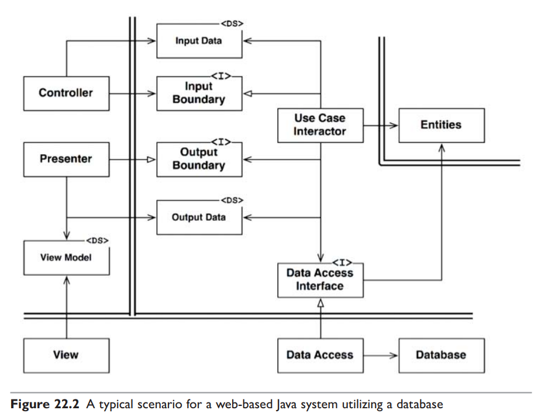
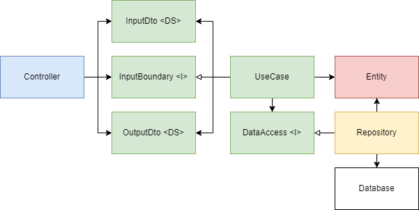

# Clean Architecture, implemented as a simple web server in Express

This repository is my attempt to implement Uncle Bob's typical clean architecture for a web server which you can see in this diagram below.

A few modifications were made. I do not have a presenter component, thus the end product is something like this:

References used:

1. Clean Architecture: A Craftman's Guide to Software Structure and Design (Robert C. Martin)
2. Implementing the Clean Architecture (Sebastian Buczyński)
